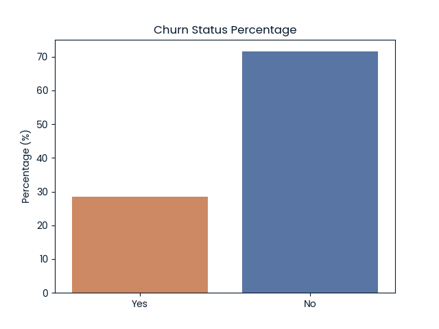
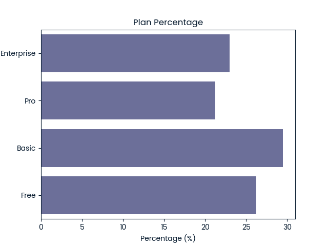
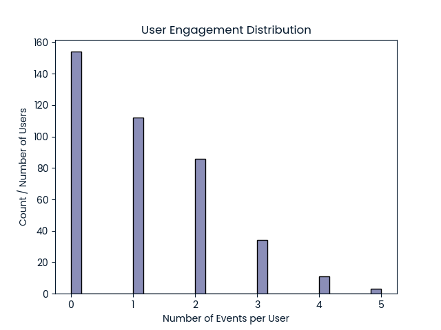
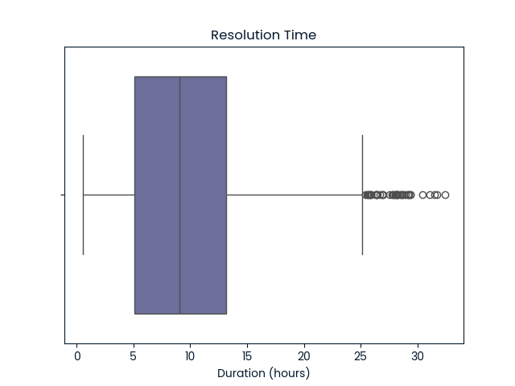
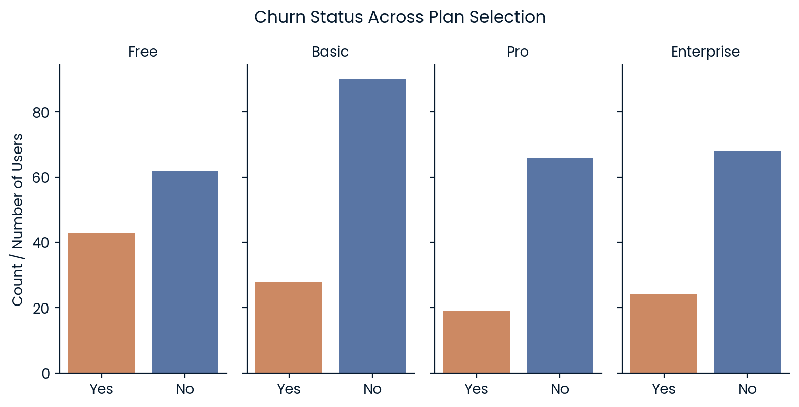
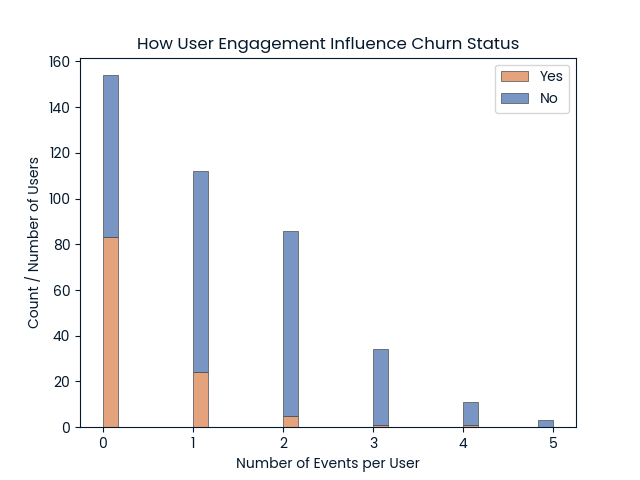
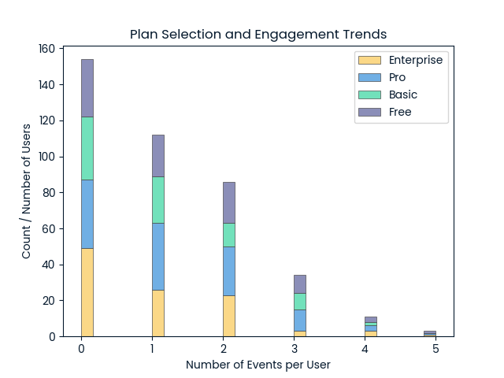
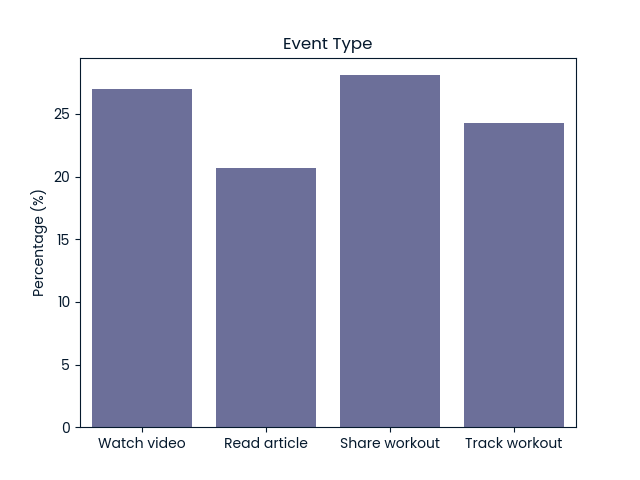
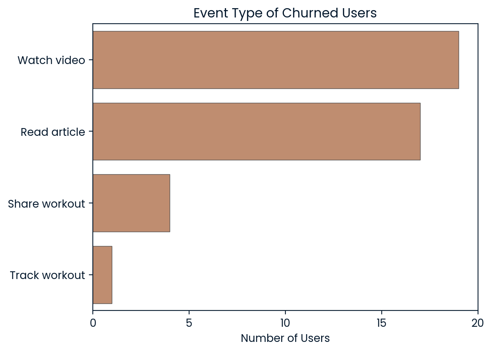
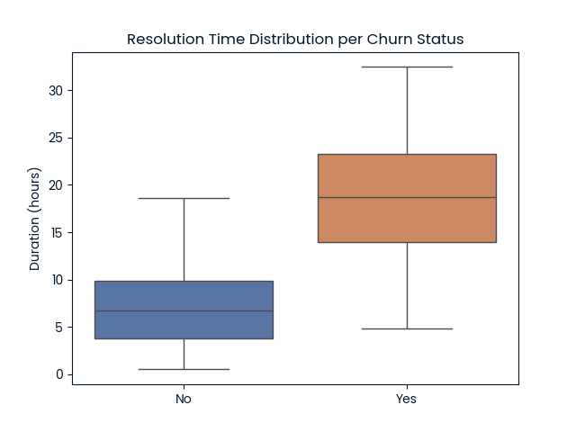

# Fitness app Customer Churn Analysis

Customer churn and user engagement analysis for a fictional fitness app. This project was created as a Data Analyst practical exam submission and is now prepared as a reproducible GitHub repository.

The notebook walks through

* validating and cleaning three related data sets
* exploratory analysis of plans, engagement, event types and support tickets
* defining business metrics to monitor churn
* practical recommendations for product and support teams

---

## Project files

Suggested repository structure

```text
.
├── README.md                  ← This file
├── notebook.ipynb             ← Main analysis notebook and written report
├── da_app_account_info.csv  ← Account and subscription information
├── da_app_user_activity.csv ← In app user events
├── da_app_customer_support.csv ← Support tickets and resolution times
├── da_sample_guest_profiles.csv   ← Extra profile data set (not central to churn task)
├── chart01_churn_percentage.png
├── chart02_plan_percentage.png
├── chart03_plan_churn.png
├── chart04_user_engagement_dist.png
├── chart05_user_engagement_churn.png
├── chart06_plan_user_engagement.png
├── chart07_event_type_percentage.png
├── chart08_event_type_churn_yes.png
├── chart09_resolution_time.png
└── chart10_resolution_time_churn.png
```

If you clone this repository and keep the relative paths, the notebook will be able to load the CSV files and display all charts without modification.

---

## Data description

### 1  `da_app_account_info.csv`

Each row is a Fitness app customer account.

Columns

* `customer_id`  string like `C10001` later converted to integer id
* `email`  unique email per user
* `state`  US state
* `plan`  subscription plan Free, Basic, Pro, Enterprise
* `plan_list_price`  monthly list price
* `churn_status`  Y for churned otherwise interpreted as N for active

### 2  `da_app_user_activity.csv`

In app engagement events.

* `event_time`  timestamp in Pacific time
* `user_id`  numeric user identifier that links to `customer_id`
* `event_type`  one of `watch_video`, `read_article`, `track_workout`, `share_workout`

### 3  `da_app_customer_support.csv`

Support interactions and resolution time.

* `ticket_time`  timestamp in Pacific time
* `user_id`  numeric user identifier
* `channel`  chat, phone, email or not specified
* `topic`  billing, account, technical, other
* `resolution_time_hours`  ticket duration in hours
* `state`  interpreted as ticket status flag
* `comments`  free text, often GDPR erasure requests

### 4  `da_sample_guest_profiles.csv`

Additional profile data used in some extended exploration but not critical for the core churn story.

---

## How to run the project locally

### 1  Requirements

You need

* Python 3.9 or later
* Jupyter Lab or Jupyter Notebook
* The packages listed below

You can create a `requirements.txt` file with the following content

```text
pandas
numpy
matplotlib
seaborn
jupyter
```

Then install everything in a virtual environment

```bash
python -m venv .venv
source .venv/bin/activate  # On Windows use `.venv\Scripts\activate`
pip install -r requirements.txt
```

### 2  Open the notebook

```bash
jupyter notebook notebook.ipynb
```

or start Jupyter Lab and open `notebook.ipynb` from the browser interface.

The notebook assumes that all CSV files are in the same folder as the notebook itself.

---

## Key analysis steps

The notebook is organised into the following main sections.

### Data validation and cleaning

For each data set the report describes

* expected data types and valid ranges
* checks for missing values and duplicates
* specific cleaning rules, for example
  * stripping the `C` prefix from `customer_id` so that it aligns with `user_id`
  * filling missing `churn_status` with N
  * converting timestamps to `datetime64`

### Exploratory analysis and visualisations

Single variable views

* Overall churn status percentage

  

* Distribution of subscription plans

  

* Distribution of user engagement, number of events per user

  

* Distribution of support resolution times

  

Multi variable views

* Churn by plan type

  

* Churn by engagement level

  

* Plan mix across engagement levels

  

* Event type mix overall and for churned users only

  

  

* Resolution time split by churn status

  

Each visual has an accompanying written interpretation in the notebook.

---

## Main findings

High level insights from the current six month window

* Around thirty percent of customers have churned
* Free plan users churn more than other plans, over forty percent in this sample
* Low engagement is strongly associated with churn, many churned users have zero or one event
* Higher priced plans do not automatically lead to higher engagement
* For churned users the majority of activity is light consumption, watching videos or reading articles, rather than tracking or sharing workouts
* Support tickets for churned users show much longer resolution times, average resolution is roughly triple that of retained users

---

## Recommended business metrics

The report proposes three metrics for the business to monitor

1  **Engagement per user**  number of events per active user in a given period
2  **Average resolution time**  mean `resolution_time_hours` for closed tickets
3  **Churn rate**  percentage of customers whose `churn_status` is Y in the period

Using the current data as a baseline

* churn rate is about 30 percent
* most users generate at most one event
* typical resolution time clusters between five and fifteen hours

The report argues that a realistic short term target is

* reduce churn from thirty percent toward twenty percent
* raise engagement so that each user has at least one event in the period
* bring average resolution time down toward six hours

---

## Reproducing or extending the analysis

You can

* rerun all cells in `notebook.ipynb` to reproduce the charts and summary
* change the groupings, for example by state or channel
* add statistical tests or simple models to predict churn from engagement and resolution time
* use the extra `da_sample_guest_profiles.csv` file to explore whether loyalty tier is related to churn or engagement

If you build on this analysis, feel free to fork the repository and document your extensions in a new section of the notebook or in a separate notebook.

---

## Acknowledgements

The data sets and original task description come from Data Analyst practical exam hosted by DataCamp. The project structure and wording have been adapted for public sharing as a portfolio piece.
